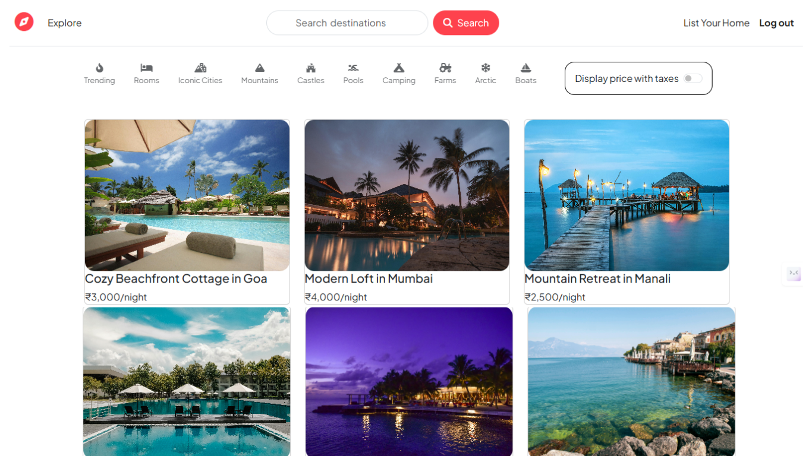

# Havenly 

**Havenly** is a full-stack web application inspired by Airbnb, built for users to discover, share, and review unique places to stay. Property owners can list their spaces, and travelers can seamlessly explore and book their next getaway.

---

## 🚀 Live Demo

🔗 [Havenly on Render](https://havenly-app.onrender.com/listings) *(deployed version of the app)*

---

## 🔑 Key Features

* **User Authentication & Security** – Secure registration and login with Passport.js and session management.
* **Interactive Maps** – Mapbox integration to show the exact location of each listing.
* **Image Uploads in Cloud** – Smooth image handling with Multer and Cloudinary storage.
* **Full CRUD for Listings** – Create, read, update, and delete your own listings.
* **Reviews & Ratings** – Users can leave detailed reviews and star ratings.
* **Authorization Control** – Owners can only edit or delete their own listings/reviews.
* **Server-Side Validation** – Joi ensures data integrity before saving to the database.
* **Flash Messages** – Real-time feedback on actions like logins, new posts, or errors.
* **Responsive UI** – Clean and mobile-friendly interface built with Bootstrap.

---

## 🛠 Tech Stack

* **Backend**: Node.js, Express.js
* **Database**: MongoDB Atlas, Mongoose
* **Frontend**: EJS, HTML5, CSS3
* **Styling**: Bootstrap
* **Auth**: Passport.js (`passport-local`, `passport-local-mongoose`)
* **File Storage**: Multer + Cloudinary
* **Maps**: Mapbox API

---

## ⚙️ Installation & Local Setup

1. **Clone the Repository**

   ```bash
   git clone https://github.com/your-username/havenly.git
   cd havenly
   ```

2. **Install Dependencies**

   ```bash
   npm install
   ```

3. **Configure Environment Variables**
   Create a `.env` file in the root and add:

   ```env
   ATLASDB_URL=<your_mongodb_atlas_connection_string>
   SECRET=<your_session_secret_key>
   CLOUD_NAME=<your_cloudinary_cloud_name>
   CLOUD_API_KEY=<your_cloudinary_api_key>
   CLOUD_API_SECRET=<your_cloudinary_api_secret>
   MAP_TOKEN=<your_mapbox_api_token>
   ```

4. **Run the Server**

   ```bash
   node app.js
   ```

5. **Open in Browser**
   Visit 👉 `http://localhost:8080`

---

## 📌 How to Use

* **Sign Up / Log In** to get started.
* Browse **all available listings** on the homepage.
* Click a listing to view **details, map location, and reviews**.
* Logged-in users can **create new listings** with images and details.
* Owners can **edit or delete** their listings.
* Any user can **leave reviews and ratings** on listings.

---

🖼️ Screenshots  
Here are some previews of the app in action:  

- All Listings Page  
    

- Single Listing Page  
    

- Auth & Create Listing  
    

---

## ✨ Project Purpose

This project was built as a **learning project** to strengthen full-stack development skills and replicate real-world app functionality like **Airbnb**.
